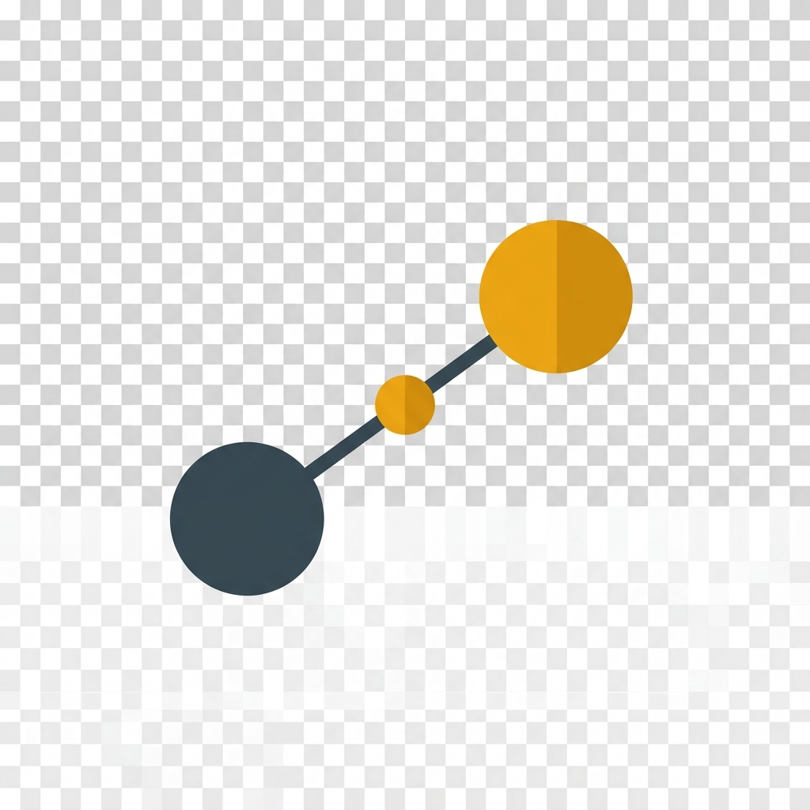

<div align="center">



# Claude Bridge

[](LICENSE)
[](https://nodejs.org/)
[](https://www.typescriptlang.org/)
[](https://modelcontextprotocol.io/)
[](https://github.com/Joncik91/claude-bridge-server/stargazers)
[](CONTRIBUTING.md)

**An MCP server that enables collaboration between [Claude Code](https://claude.ai/code) and [Z.ai's GLM models](https://z.ai) — use Claude Opus for planning while GLM handles implementation.**

Combine the strengths of Claude Code and Z.ai's GLM in one workflow. This MCP server lets Opus
handle high-level planning while GLM tackles implementation — coordinated through a shared task
queue, running simultaneously in separate terminals. Run Claude Code with your Max
subscription or API for architecture, and Claude Code with Z.ai (GLM) for execution — both working together at the same time.

</div>

## Table of Contents

- [Why This Exists](#why-this-exists)
- [Quick Example](#quick-example)
- [Features](#features)
- [When NOT to Use This](#when-not-to-use-this)
- [Prerequisites](#prerequisites)
- [Quick Start](#quick-start)
- [Documentation](#documentation)
- [Works with Other MCP Clients Too](#works-with-other-mcp-clients-too)
- [Security](#security)
- [License](#license)

---

## Why This Exists

You have a Claude subscription but you're hitting limits. Getting a second Claude subscription is pricey (or upgrading might be too expensive) — but a Z.ai subscription costs less and GLM codes just as well as Sonnet.

**The question:** How do you make Claude and GLM work together?

**The answer:** Claude Bridge. An MCP server that coordinates both through a shared task queue.

```
┌─────────────────────────┐                    ┌─────────────────────────┐
│   Terminal 1            │                    │   Terminal 2            │
│   Claude Opus           │                    │   Z.ai GLM              │
│   (Architect)           │                    │   (Executor)            │
│                         │    Claude Bridge   │                         │
│   • Plans features      │◄──────────────────►│   • Pulls tasks         │
│   • Designs architecture│    (Shared Queue)  │   • Writes code         │
│   • Makes decisions     │                    │   • Reports back        │
└─────────────────────────┘                    └─────────────────────────┘
```


## Quick Example

**Terminal 1 (Opus):** "Push a task to implement JWT authentication"

**Terminal 2 (GLM):** "Pull the next task" → implements → "Complete the task"

**Terminal 1:** "What did the executor complete?" → reviews results

## Features

- **Task Queue** — Priority-based with dependencies and categories
- **Shared State** — Project focus and decisions visible to both
- **Session Context** — Resume where you left off
- **Clarifications** — Executor asks questions, Architect responds
- **Token-Conscious** — Designed to minimize Opus usage

## When NOT to Use This

If you're using a **planning framework** like [Get-Shit-Done (GSD)](https://github.com/cyanheads/get-shit-done), you don't need this bridge. Frameworks like GSD store context in project files (`.planning/`) that both terminals can read directly. Slash commands like `/gsd:plan-phase` and `/gsd:execute-phase` work in any terminal.

**Use Claude Bridge for:**
- Ad-hoc tasks, quick fixes, one-off research
- Projects without a planning framework
- Session continuity across restarts

**Skip the bridge if:**
- Using GSD or similar file-based planning frameworks
- Both terminals share the project filesystem

## Prerequisites

- **Node.js 18+** — [Download](https://nodejs.org/)
- **Claude Code CLI** — [Installation](https://docs.anthropic.com/en/docs/claude-code)
- **Z.ai account** — For GLM access ([z.ai](https://z.ai))
- **Two terminal windows**

### Terminal Profile Setup

**Same subscription in both terminals?** Just run `claude` in each — no profile setup needed.

**Claude + Z.ai GLM?** Add this function to your shell profile:

**Windows PowerShell** (`notepad $PROFILE`):
```powershell
function use-glm {
    $env:ANTHROPIC_BASE_URL = "https://api.z.ai/api/anthropic"
    $env:ANTHROPIC_AUTH_TOKEN = "your_zai_api_key_here"
    Write-Host ">>> GLM ACTIVE (Executor mode)" -ForegroundColor Cyan
}
```

**macOS/Linux** (`~/.bashrc` or `~/.zshrc`):
```bash
use-glm() {
    export ANTHROPIC_BASE_URL="https://api.z.ai/api/anthropic"
    export ANTHROPIC_AUTH_TOKEN="your_zai_api_key_here"
    echo ">>> GLM ACTIVE (Executor mode)"
}
```

**Usage:**
- Terminal 1: Just run `claude` (uses your Claude subscription)
- Terminal 2: Run `use-glm`, then `claude` (uses Z.ai API)

See [GUIDE.md](GUIDE.md#terminal-profile-setup) for complete setup details.

## Quick Start

```bash
# 1. Clone and build
git clone https://github.com/Joncik91/claude-bridge-server.git
cd claude-bridge-server
./setup.sh          # or setup.bat on Windows

# 2. Configure MCP (see GUIDE.md for details)
claude mcp add --scope user --transport stdio claude-bridge -- node /path/to/server/dist/index.js
```

## Documentation

**[GUIDE.md](GUIDE.md)** — Complete setup, terminal configuration, usage, and troubleshooting

## Works with Other MCP Clients Too

While designed for Claude + GLM, the bridge is a standard MCP server — it works with any MCP-compatible CLI:

- Two Claude Code instances (same or different subscriptions)
- [Gemini CLI](https://github.com/google-gemini/gemini-cli)
- [OpenCode](https://opencode.ai/)
- [Qwen Code](https://github.com/QwenLM/qwen-code)
- Any other MCP client

## Security

Claude Bridge sits between two CLIs that hold real API tokens. Three
implications worth being explicit about.

- **API tokens never pass through the bridge.** The server's
  protocol carries tasks, statuses, and results — not credentials.
  Each terminal authenticates against its own provider directly
  (your Claude subscription on one side, your Z.ai key on the other).
  The shell-profile pattern in [Prerequisites](#prerequisites) is
  there so the *terminal session* sets `ANTHROPIC_AUTH_TOKEN` —
  the bridge never reads it.
- **Don't commit `use-glm` with a literal key.** The shell-profile
  snippets in this README and `GUIDE.md` use a placeholder — replace
  it with `${ZAI_API_KEY}` or similar and load the secret from a
  password manager / system keychain. A literal key in `~/.bashrc`
  is a literal key on every backup of your home directory.
- **The shared task queue is local to the bridge process.** Tasks,
  clarifications, and reviewer notes live in the bridge's in-memory
  state. Don't aim two unrelated projects at the same bridge
  instance — the queue is single-tenant by design.

For team use: each pair of architect+executor terminals should run
its own bridge process, not share one. The MCP transport is stdio
on the local machine; nothing listens on a network port.

## License

MIT — see [LICENSE](LICENSE).

## Acknowledgments

- Built for [Claude Code](https://claude.ai/code) by Anthropic
- Designed for [Z.ai](https://z.ai) GLM integration

<a href="https://glama.ai/mcp/servers/@Joncik91/claude-bridge-server">
  
</a>
